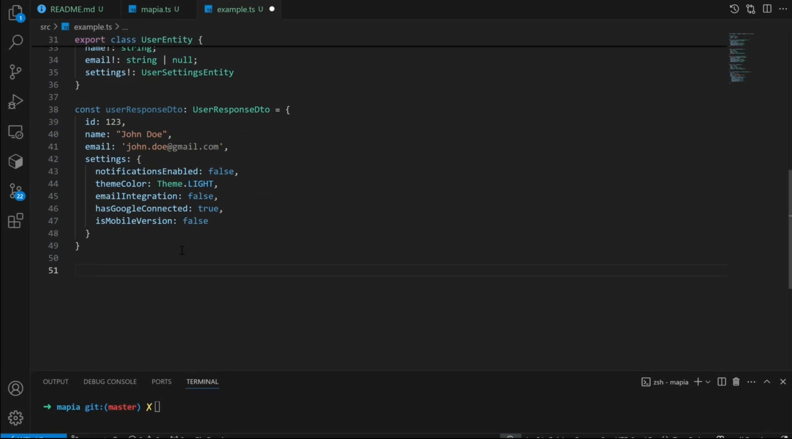
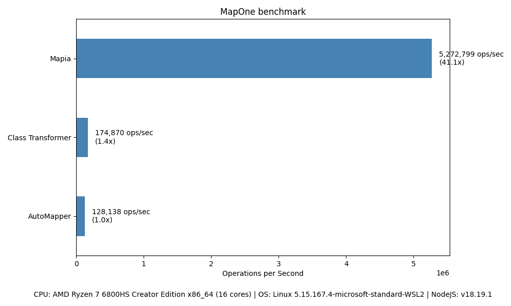

# Mapia


[](https://github.com/alexcupertme/mapia/actions/workflows/test.yml)
[](https://codecov.io/gh/alexcupertme/mapia)

<p align="center">

</p>

Mapia is a lightweight and type-safe object mapping library for TypeScript. It simplifies the process of transforming objects from one shape to another, ensuring type safety and flexibility.

[▶️ Watch demo on YouTube](https://www.youtube.com/watch?v=C8GeUHRRTRw)
[](https://www.youtube.com/watch?v=C8GeUHRRTRw)

**Why Mapia?**
> - 🧙 IDE-friendly auto-mapping
> - 🪶 Zero dependencies, 80kb unzipped size. Can be used in browsers!
> - 🧪 Type-safe, works with any type, class, generics
> - 🧼 Minimal setup, no boilerplate
> - ⚡ **35x faster** than `class-transformer`

# Table of Contents
- [Mapia](#mapia)
  - [Introduction](#introduction)
  - [Installation](#installation)
  - [Usage](#usage)
    - [Basic Example](#basic-example)
    - [Nested Structures](#nested-structures)
    - [Other](#other)
  - [Advanced Usage](#advanced-usage)
    - [Aliases](#aliases)
    - [Functional Programming Style](#functional-programming-style)
    - [Shapes](#shapes)
      - [Ready-to-Use Shapes](#ready-to-use-shapes)
      - [Creating Your Own Shapes](#creating-your-own-shapes)
  - [`mapRecord`](#maprecord)
  - [Why Mapia is Better than AutoMapper-TS](#why-mapia-is-better-than-automapper-ts)
    - [The Problem with AutoMapper-TS](#the-problem-with-automapper-ts)
    - [Example of Issues with AutoMapper-TS](#example-of-issues-with-automapper-ts)
    - [How Mapia Solves These Issues](#how-mapia-solves-these-issues)
  - [Contributing](#contributing)
  - [Benchmark](#benchmark)
  - [License](#license)

## Introduction

When working with JSON objects, DTOs, entities, API responses, or other structured data, you often face this common problem:

```ts
// Some Input type "A"
type InputDto = {
  field1: string;

  otherField: string;
  anotherField: string;
  yetAnotherField: string;
}
// Type "B", Almost the same as "A"
type Entity = {
  field1: number; // this field fucks up the whole mapping

  otherField: string;
  anotherField: string;
  yetAnotherField: string;
}

const persistToDB = (input: Partial<Entity>) => {
  // Some logic to persist to DB
}
const input: InputDto = {...} // How do we map input to Entity?
persistToDB(input); // Type 'InputDto' is not assignable to type 'Entity'
```

This is just a simple example, but in reality, you can have dozens of the models, that are almost the same, but they dont.

Here's how you can solve this problem with Mapia.

```ts
import { compileMapper, rename, transform, ignore } from 'mapia';

type InputDto = {
  field1: string;
  otherField: string;
  anotherField: string;
  yetAnotherField: string;
}

type Entity = {
  field1: number;
  otherField: string;
  anotherField: string;
  yetAnotherField: string;
}

// Here we are just described Input and Output in our mapper as type arguments
const inputToEntityMapper = compileMapper<InputDto, Entity>({
  field1: transform((x) => Number(x)),
  otherField: "otherField", // These fields are auto-suggested by your IDE, thanks to strong type inference. This is a real automapping magic 🔮 
  anotherField: "anotherField", // If your Input or Output shapes changes, you'll immediately get a type check error
  yetAnotherField: "yetAnotherField",
});

const persistToDB = (input: Partial<Entity>) => {
  // Some logic to persist to DB
}

const input: InputDto = {  
  field1: "123",
  otherField: "...",
  ...
};

persistToDB(inputToEntityMapper.mapOne(input)); // We are chill here 🍹
```

You also want to map array of objects, or objects with nested structures? No problem, Mapia can do that too.
```ts
import { compileMapper, rename, transform, ignore, transformWithRename } from 'mapia';

export enum BankAccountStatus {
  ACTIVE = "ACTIVE",
  SUSPENDED = "SUSPENDED",
}

export enum Currency {
  USD = "USD",
  EUR = "EUR",
}

export class BankStatsResponse {
  totalBalance!: number;
  totalTransactions!: number;
  totalDeposits!: number;
  totalWithdrawals!: number;
}

// poor bank api developers
export type BankSettingsResponse = {
  twoFactorAuthEnabled: 'yes' | 'no';
  notificationsEnabled: 'yes' | 'no';
  safeModeEnabled: 'yes' | 'no';
  currency: Currency;
};

// giga-chad bank api developers
export class BankSettingsEntity {
  hasTwoFactorAuth!: boolean;
  enabledNotifications!: boolean;
  safeMode!: boolean;
  currency!: Currency;
}

export class BankAccountResponse {
  id!: string;
  name!: string;
  currency!: Currency;
  status!: BankAccountStatus;
  statistics!: BankStatsResponse;
  settings!: BankSettingsResponse;
}

export class BankAccountStatisticsEntity {
  totalBalance!: number;
  totalTransactions!: number;
  totalDeposits!: number;
  totalWithdrawals!: number;
}

export class BankAccountEntity {
  accountId!: string;
  name!: string;
  currency!: Currency;
  status!: BankAccountStatus;
  statistics!: BankAccountStatisticsEntity;
  settings!: BankSettingsEntity;
}

export const bankSettingsMapper = compileMapper<BankSettingsResponse, BankSettingsEntity>({
  hasTwoFactorAuth: transformWithRename((x) => x.twoFactorAuthEnabled === 'yes'),
  enabledNotifications: transformWithRename((x) => x.notificationsEnabled === 'yes'),
  safeMode: transformWithRename((x) => x.safeModeEnabled === 'yes'),
  currency: 'currency',
});

export const bankAccountMapper = mapia.compileMapper<BankAccountResponse, BankAccountEntity>({
  accountId: rename('id'),
  name: 'name',
  currency: 'currency',
  status: 'status',
  settings: transformWithRename((x) => bankSettingsMapper.mapOne(x.settings)), // You can compose mappers in a functional way
  statistics: 'statistics' // If you're exactly matching your resulting type, you just dont have to write mapper for it - even though statisics nested - because types match
});

const bankAccountResponse: BankAccountResponse[] = [{...}] // A lot of bank accounts

const mapped: BankAccountEntity[] = bankAccountMapper.mapMany(bankAccountResponse); // Its just this simple
```

Mapia offers the following features:

- **Declarative Syntax**: Every mapping is defined in a simple and readable way, making it easy to understand and maintain.
- **Type Inference**: TypeScript infers the types of your mappings, reducing the need for manual type annotations.
- **Functional Composition**: You can compose mappers and use them in a functional way, making it easy to reuse mappings across different parts of your application.
- **Flexible Directives**: Supports renaming, transforming, and ignoring fields without headache and misspelling. More directives are coming soon.

## Installation

**NPM**
```bash
npm install mapia
```

**PNPM**
```bash
pnpm add mapia
```

**YARN**
```bash
yarn add mapia
```

## Usage

There are 4 ways what we can do with a field
1. **Rename**: Basically, just picks value from another field in source. You **cannot** pass a function here, only a field key. You also cannot pass own property name, and property name that don't match by type. This is a verbose way to know what you are doing.
```ts
const userMapper = compileMapper<UserResponse, UserEntity>({
  id: rename('userId'), // This will pick value from source 'userId' and pass it to 'id'
  id: rename('id'), // Will throw error
  id: rename('currency') // Accidentally specified property with wrong type, you'll get a type error
});
```
2. **Transform**: Transform a field from the source object to the destination object. 
```ts
const userMapper = compileMapper<UserResponse, UserEntity>({
  id: transform((x) => Number(x)), // This will transform the field 'id' from string to number
  createdAt: transform((x) => new Date(x)), // This will transform the field 'createdAt' from string to Date
});
```
3. **Ignore**: Ignore a field from the source object to the destination object. This is useful when you want to skip a field that is optional in the Output object.
```ts
const userMapper = compileMapper<UserResponse, UserEntity>({
  id: 'id',
  age: 'age',
  name: rename('name'),
  createdAt: transform((x) => new Date(x)),
  updatedAt: ignore(), // This field will be ignored
});
```

4. **Transform with Rename**: You can change the whole shape of the property, its type and name. This is an explicit way of saying: "Yes, this property doesn’t match, and I know what I'm doing."
```ts
const userMapper = compileMapper<UserResponse, UserEntity>({
  id: transform((x) => Number(x)),
  age: 'age',
  name: rename('name'),
  createdAt: transform((x) => new Date(x)),
  updatedAt: ignore(), // This field will be ignored
  address: transformWithRename((x) => addressMapper.mapOne(x.tags.find(x => ...))), // Some complex logic
});
```

### Basic Example

```ts
import { compileMapper, rename, transform, ignore } from 'mapia';

type UserResponse = {
  id: string;
  age: number;
  name: string;
  createdAt: string;
};

type UserEntity = {
  id: number;
  age: number;
  name: string;
  createdAt: Date;
  updatedAt?: Date;
};

const userMapper = compileMapper<UserResponse, UserEntity>({
  id: transform((x) => Number(x)),
  age: 'age',
  name: rename('name'),
  createdAt: transform((x) => new Date(x)),
  updatedAt: ignore(), // This field will be ignored
});

const userResponse: UserResponse = {
  id: "1",
  age: 25,
  name: "John Doe",
  createdAt: "2023-01-01",
};

const userEntity = userMapper.mapOne(userResponse);
console.log(userEntity);
```

### Nested Structures

```ts
type CurrentLocation = {
  lat: number;
  lon: number;
  city: string;
  country: string;
};

type Address = {
  city: string;
  country: string;
}

type UserResponse = {
  name: string;
  location: CurrentLocation;
};

type UserEntity = {
  fullName: string;
  address: Address;
};

const addressMapper = compileMapper<CurrentLocation, Address> = ({
  city: "city",
  country: "country",
});

const userMapper = compileMapper<UserResponse, UserEntity>({
  fullName: rename("name"),
  address: transformWithRename((user) => addressMapper.mapOne(user.location)),
});

const userResponse: UserResponse = {
  name: "John Doe",
  address: {
    city: "New York",
    country: "USA",
  },
};

const userEntity = userMapper.mapOne(userResponse);
```

### Other

More examples can be found [here](./examples)

## Advanced Usage


### Shapes

Shapes are predefined or custom functions that help you transform data types. Mapia provides several ready-to-use shapes, and you can also create your own.

Shapes are written with love to a functional programming style, so you can compose them together.

#### Ready-to-Use Shapes

Some of the ready-to-use shapes provided by Mapia include:

- `stringShape`: Converts a value to a string.
- `numberShape`: Converts a value to a number.
- `dateShape`: Converts a value to a Date object.
- `urlOrNullShape`: Converts a value to a URL or returns `null` if the conversion fails.
- `urlOrThrowShape`: Converts a value to a URL or throws an error if the conversion fails.

Example:

```ts
import { stringShape, numberShape, compileMapper } from 'mapia';

type ComplexVersion = {
  major: number;
  minor: number;
  patch: number;
};

type SerializedComplexVersion = {
  major: string;
  minor: string;
  patch: string;
};

const version: Complex = {
  major: 1,
  minor: 0,
  patch: 0,
};

const mapper = compileMapper<ComplexVersion, SerializedComplexVersion>({
  major: transform(stringShape),
  minor: transform(stringShape),
  patch: transform(stringShape),
});
```

If you also need to convert undefined to null, you can compose own shape:

```ts
import { numberShape, nullableShapeFrom } from 'mapia';

type PostgresRequestsStats = {
  total?: string;
  success?: number;
  failed?: number;
}

type PostgresRequestStatsDto = {
  total: number | null;
  success: number | null;
  failed: number | null;
}

const statsMapper = compileMapper<PostgresRequestsStats, PostgresRequestStatsDto>({
  total: transform(nullableShapeFrom(numberShape)), // number | undefined -> number | null
  success: transform(nullableShapeFrom(numberShape)), // We also can avoid this long line, read about aliases below
  failed: transform(nullableShapeFrom(numberShape)),
});
```

More shapes can be found in the [source code](./src/shapes.ts).

### Creating Your Own Shapes

You can create custom shapes by defining a function that transforms the input value to the desired output type. For example:

```ts
const customShape = (value: ComplexVersion): SerializedComplexVersion => {
  return `${value.major}.${value.minor}.${value.patch}`;
};

const complexMapped = mapRecord(complexVersions, customShape);
console.log(complexMapped);
```

### `mapRecord`

The `mapRecord` function allows you to transform the values of a record while keeping the keys unchanged. This is particularly useful for mapping simple key-value pairs.

Example:

```ts
import { mapRecord, stringShape } from 'mapia';

const versions = {
  react: 18,
  'react-dom': 18,
};

const mapped = mapRecord(versions, stringShape);
console.log(mapped); // { react: '18', 'react-dom': '18' }
```

### Aliases

Mapia provides several aliases to make your code more concise and readable. These aliases are shorthand for commonly used functions and directives:

Mapping aliases:
- `mv`: Alias for `rename`.
- `tr`: Alias for `transform`.
- `trw`: Alias for `transformWithRename`.
- `ig`: Alias for `ignore`.

Shape aliases:
- `nullMM`: Alias for `nullableMapManyShape`.
- `nullMO`: Alias for `nullableMapOneShape`.
- `MM`: Alias for `mapManyShape`.
- `MO`: Alias for `mapOneShape`.

More can be found in the [source code](./src/aliases.ts).

For example:

```ts
import { mv, tr, ig, numberShape } from 'mapia';

const userMapper = compileMapper<UserResponse, UserEntity>({
  id: tr(numberShape), // We have a ready field mapper for this
  name: mv('fullName'),
  age: 'age',
  updatedAt: ig(),
});
```

### Functional Programming Style

Mapia embraces functional programming principles, allowing you to compose and reuse mappers in a declarative and type-safe manner. This makes your code more modular and easier to maintain.

For example, you can compose mappers for nested structures:

```ts
const addressMapper = compileMapper<CurrentAddress, Address>({
  city: 'city',
  country: 'country',
});

const addressFieldMapper = transformWithRename(MO(addressMapper));

const userMapper = compileMapper<UserResponse, UserEntity>({
  fullName: rename('name'),
  address: addressFieldMapper, // UserResponse has an address property
  createdAt: transform(nullableShapeFrom(dateDecoder)), // Creating own shape, Date | undefined -> Date | null
  updatedAt: ig(), // This field will be ignored
});
```

## Why Mapia is Better than AutoMapper-TS

AutoMapper-TS is a popular library for object mapping, but it has some significant drawbacks that can lead to runtime issues if not used carefully. Here's why Mapia is a better alternative:

### The Problem with AutoMapper-TS

1. **Lack of Type Safety**: AutoMapper-TS relies heavily on runtime configurations and decorators. If you forget to add a decorator or misconfigure a mapping, the error will only surface at runtime, potentially causing critical bugs.

2. **Silent Failures**: Missing decorators or incorrect configurations often result in silent failures, where fields are simply not mapped without any warnings or errors.

3. **Boilerplate Code**: AutoMapper-TS requires a lot of boilerplate code to set up mappings, especially for nested objects or complex transformations.

### Example of Issues with AutoMapper-TS

```ts
export const mapper: Mapper = createMapper({
  strategyInitializer: classes(),
});

createMap(mapper, BankStatsResponse, BankAccountStatisticsEntity);

createMap(
  mapper,
  BankAccountResponse,
  BankAccountEntity,
  forMember(
    (dest) => dest.accountId,
    mapFrom((src) => src.id),
  ),
);
```

```ts
import { AutoMapper, ProfileBase } from 'automapper-ts';

class UserResponse {
  @AutoMap()
  id: string;
  @AutoMap()
  name: string;
  @AutoMap()
  age: number;
}

class UserEntity {
  @AutoMap()
  id: number;
  @AutoMap()
  fullName: string;
  age: number; // Oops we forgot to add decorator here
}

export const mapper: Mapper = createMapper({
  strategyInitializer: classes(),
});

createMap(mapper, UserResponse, UserEntity);
createMap(
  mapper,
  UserResponse,
  UserEntity,
);


const userResponse = new UserResponse();
userResponse.id = '1';
userResponse.name = 'John Doe';
userResponse.age = 25;

const userEntity = mapper.map(userResponse, UserEntity);
console.log(userEntity);
// Output: { id: 1, fullName: 'John Doe', age: undefined }
// The 'age' field is silently ignored because it was not mapped.
```

### How Mapia Solves These Issues

Mapia eliminates these problems by providing a declarative and type-safe approach to object mapping.

With Mapia, you can be confident that your mappings are correct and type-safe, reducing the risk of runtime errors and silent failures.

## Benchmark



See more details in the [benchmark](./benchmark) folder.

Run it yourself (first clone repo):

```bash
pnpm run:bench
```

## ❤️ Support Mapia

If you find Mapia useful, please give it a ⭐ on GitHub! It helps visibility and motivates continued development. 🤩

## Contributing

Contributions are welcome! Please open an issue or submit a pull request for any improvements or bug fixes.

## License

Mapia is licensed under the [MIT License](./LICENSE).
