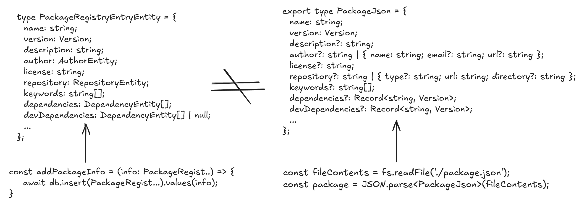

# Basic usage

This page will walk you through the basics of creating mappings, converting one object to another, and different ways how to make it easier.

You can find complete references for all the functions in the [Defining mappings](/usage/defining-mappings).

## Battle plan

Let's have a look at the our demo application.
We want to create a simple NPM package registry API:

We will parse a JSON file with package metadata and save it to the database.



> [!NOTE]
> Look at these two types carefully. They are similar, but not identical.
> Database accepts only `Nullable` fields, while parsed JSON file can have omitted fields.
> It is not possible to assign our file straight to the database. Let's convert it!

At the end of the article, we will map the full `PackageJson` object.

## Compile a mapper

To create a mapper, use `compileMapper`.

> [!NOTE]
> It is better to separate the mapper definition from the mapper usage.
> Place it in a separate file and export it.

When the field names and types match, you can use the shorthand syntax.

::: code-group
```ts [mapper.ts]
import { compileMapper } from 'mapia';
import { NameRequest } from './api';
import { Name } from './form';

const nameMapper = compileMapper<Name, NameRequest>({
  // These fields type and name matches directly. It will be copied as-is.
  firstName: 'firstName',
  lastName: 'lastName',
});

console.log(
  nameMapper.mapOne({
    firstName: 'John',
    lastName: 'Doe',
  })
);
```

```ts [form.ts]
type Name = {
  firstName?: string | undefined;
  lastName?: string | undefined;
};
```

```ts [api.ts]
type NameRequest = {
  firstName?: string | undefined;
  lastName?: string | undefined;
};
```
:::

> [!TIP] 
> When writing a mapper, you don't have to write direct typings yourself. IDE will advise you to autofill the properties automatically!

## FAQ

### 1. What is this syntax?

```ts
const nameMapper = compileMapper<Name, NameRequest>({
  firstName: 'firstName',
  lastName: 'lastName',
});
```

This is a **mapper** - a small but powerful abstraction that acts as a **contracted bridge between two types**.

It is especially useful when connecting:

* Components owned by different teams
* Modules developed at different times
* External systems where you **cannot enforce naming conventions or shared type definitions**

Instead of relying on structural coincidence, the mapper makes the transformation **explicit, intentional, and verifiable at compile time**.

---

### 2. Why can’t we “map” the old-fashioned way?

TypeScript is **structurally typed** (often called *duck typing*).

That means a value is considered valid if it matches the required *shape* - not if it represents the *correct concept*.

This flexibility is convenient, but it comes with a cost:

* Missing fields are allowed
* Partial objects silently pass
* Refactors compile but break behavior
* Mission-critical code can drift without alarms

TypeScript optimizes for *compatibility*, not *correctness of intent*.

And that’s where silent errors are born.

---

### 3. What is duck typing - and why is it dangerous?

Duck typing allows compatibility, but it does **not enforce intent**.

Consider this example:

```ts
const fun = (dto: { firstName?: string }) => {
  console.log(`Hello, ${dto.firstName}!`);
};

fun({ firstName: "Lesya" }); // Hello, Lesya!
```

At first glance, this looks harmless.

But now the function evolves:

```ts
const fun = (dto: { firstName?: string; lastName?: string }) => {
  console.log(`Hello, ${dto.firstName} ${dto.lastName}!`);
};

// Still no errors
fun({ firstName: "Lesya" }); // Hello, Lesya undefined
```

No compiler error.
No warning.
No signal that the contract has changed.

This is a **ticking time bomb**.

The caller is now *logically incorrect* but still *type-correct*.

---

### 4. How does a mapper fix this?

Our mapper uses a set of type-level techniques to leverage the TypeScript compiler and ensure that **all required fields are explicitly mapped**.

That is why the mapper intentionally forces you to re-declare each field.
This is a **one-time, explicit cost** that pays off by preventing silent bugs, unsafe refactors, and broken contracts in the future.

You are restricted to:

* Which fields are required
* Which fields are mapped
* Which transformations are allowed

If a field is added, renamed, or removed - the mapper **breaks at compile time**.


Let's get back to our course.

## Rename

Use `rename` to pull a value from another property. This is the verbose option that keeps your intent explicit and uses TypeScript to ensure the source property exists.

::: code-group
```ts [mapper.ts]
const userMapper = compileMapper<UserResponse, UserEntity>({
  id: rename('userId'),
});
```

```ts [response.ts]
type UserResponse = {
  userId: string; // matches the type of UserEntity, different name
}
```

```ts [entity.ts]
type UserEntity = {
  id: string; // matches the type of UserResponse, different name
}
```
:::

> [!NOTE] 
> Note that the keys of the mapper match Target type props (UserEntity)
> When you write a mapper, first argument of the generics argument specifies SourceType, second specifies TargetType: `<Source, Target>`

## Transform

`transform` accepts a function that adjusts the value before it hits the destination object.

```ts
const userMapper = compileMapper<UserResponse, UserEntity>({
  createdAt: transform((x) => new Date(x)),
});
```

Property transforms are common across project, so you can use ready shapes to reduce code duplication and bugs.

```ts
import { dateShape } from 'mapia';

const userMapper = compileMapper<UserResponse, UserEntity>({
  createdAt: transform(dateShape),
});
```

Or you can create your own. [More about shapes](./shapes.md)

## Ignore

Use `ignore` for fields that don't exist on the source and are optional in the destination.

::: code-group
```ts [mapper.ts]
const userMapper = compileMapper<UserResponse, UserEntity>({
  id: 'id',
  updatedAt: ignore(),
});
```

```ts [response.ts]
type UserResponse = {
  id: string;
}
```

```ts [entity.ts]
type UserEntity = {
  id: string;
  updatedAt?: Date; // Optional. Will be filled at the database insert
}
```
:::

## Nested Structures

### Direct mapping

Mapia can handle nested objects and arrays without extra ceremony.

In the first case we have a country property, which is mapped directly, because their target type and source type are equal.

::: code-group

```ts [mapper.ts]
const addressMapper = compileMapper<AddressResponse, AddressEntity>({
  street: 'street',
  country: 'country',
  city: 'city',
  zipCode: rename('zip'),
});
```
```ts [response.ts]
type CountryResponse = {
  name: string;
  code: string; 
}

type AddressResponse = {
  street: string;
  country: CountryResponse;
  zip: string;
}
```

```ts [entity.ts]
type CountryEntity = {
  name: string;
  code: string;
}

type AddressEntity = {
  street: string;
  country: CountryEntity;
  zipCode: string;
}
```
:::

### `map` directive

What if our nested objects aren't the same? Well, this is not a problem!
This is a very common use case, and we have a special directive for it: `map`

It maps the object if the source and target prop keys are equal, but their contents are uneven

::: code-group

```ts [mapper.ts]
const addressMapper = compileMapper<AddressResponse, AddressEntity>({
  street: 'street',
  country: map({
    countryName: rename('name'),
    code: 'code',
  }),
  city: 'city',
  zipCode: rename('zip'),
});
```
```ts [response.ts]
type CountryResponse = {
  name: string;
  code: string; 
}

type AddressResponse = {
  street: string;
  country: CountryResponse;
  zip: string;
}
```

```ts [entity.ts]
type CountryEntity = {
  countryName: string;
  code: string;
}

type AddressEntity = {
  street: string;
  country: CountryEntity;
  zipCode: string;
}
```
:::

### `flatMap` directive

This directive name was inspired by Array.prototype.flatMap, but instead of arrays, it switches context. 

Let's have a look at the `response.ts`: we removed the `CountryResponse` type and flattened `AddressResponse` structure. If we try use map({}), it won't be able to see top properties. 

`flatMap` hoists our context to pick property we want

::: code-group

```ts [mapper.ts]
/** === this will NOT work **/
const addressMapper = compileMapper<AddressResponse, AddressEntity>({
  street: 'street',
  country: map({
    countryName: 'countryName',
    code: rename('countryCode'),
  }),
  city: 'city',
  zipCode: rename('zip'),
});

/** === this is CORRECT === **/
const addressMapper = compileMapper<AddressResponse, AddressEntity>({
  street: 'street',
  country: flatMap({ // change map to flatMap
    countryName: 'countryName',
    code: rename('countryCode'),
  }),
  city: 'city',
  zipCode: rename('zip'),
});

```
```ts [response.ts]
type AddressResponse = {
  street: string;
  countryName: string;
  countryCode: string;
  zip: string;
  city: string;
}
```

```ts [entity.ts]
type CountryEntity = {
  countryName: string;
  code: string;
}

type AddressEntity = {
  street: string;
  country: CountryEntity;
  zipCode: string;
  city: string;
}
```
:::

### Working with arrays

`map` directive is a very flexible and powerful tool - it can even work with arrays!s

You don't have to specify the 'mode' or some settings. Mapper will recognize your type at runtime and map everything correct

::: code-group

```ts [mapper.ts]
const carWashAnalyticsMapper = compileMapper<CarWashStatisticsResponse, CarWashStatistics>(
  {
    id: 'id',
    todayClients: map({
      clientID: rename('id'),
      totalPaycheck: rename('ltv'),
      carModel: 'carModel'
    }),
    topClients: map({})
  }
);
```

```ts [response.ts]
type ClientResponse = {
  id: string;
  carModel: string;
  ltv: number;
  lastVisitedAt: Date;
}

type CarWashStatisticsResponse = {
  id: string;
  todayClients: ClientResponse[];
  topClients: ClientResponse[];
}
```

```ts [entity.ts]
type ClientEntity = {
  carModel: string;
  totalPaycheck: number;
  clientID: string;
}

type CarWashStatistics = {
  id: string;
  todayClients: ClientEntity[];
  topClients: ClientEntity[];
}
```
:::

> [!NOTE]
> Rename would not allow you to pick arbitrary field - only those are having same type and in the same (or more deep) context

### Nullable objects, optional objects

You also can map objects and arrays whose type is a union with `null` or `undefined`.

- For `null` | `undefined` => `null` you should use **`nullalbleMap`**
- For `null` | `undefined` => `undefined` you should use **`optionalMap`**

::: code-group
```ts [mapper.ts]
const mapper = compileMapper<MedicalHistoryForm, MedicalHistory>({
  personalInformation: 'personalInformation',
  diagnoses: nullableMap({
    date: 'date',
    code: 'code',
    name: 'name',
    diagnosingPhysican: 'diagnosingPhysican',
  }),
});
```

```ts [form.ts]
type DiagnoseForm = {
  date: Date;
  code: string;
  name: string;
  diagnosingPhysican: `${string} ${string} ${string}`
}

type PersonalInformationForm = {
  name: string;
  contactNumber: string;
}

type MedicalHistoryForm = {
  personalInformation: PersonalInformation;
  diagnoses?: Diagnose[];
}
```

```ts [ui.ts]
type Diagnose = {
  date: Date;
  code: string;
  name: string;
  diagnosingPhysican: `${string} ${string} ${string}`
}

type PersonalInformation = {
  name: string;
  contactNumber: string;
}

type MedicalHistory = {
  personalInformation: PersonalInformation;
  diagnoses: Diagnose[] | null;
}
```
:::

## Final Result

Now, when we've learned basic aspects of Mapia, we can ready our NPM package mapper: 

::: code-group
```ts [mapper.ts]
type OK_PackageRegistryEntryResponse = DeepCastTypes<PackageRegistryEntryResponse, undefined, null>

const packageRegistryFromResponseToEntity = compileMapper<
  OK_PackageRegistryEntryResponse,
  PackageRegistryEntryEntity
>({
  name: "name",
  description: "description",
  license: "license",
  keywords: "keywords",
  scripts: "scripts",
  private: 'private',
  readme: 'readme',
  homepage: transform(urlOrNullShape),
  version: "version",
  author: map({
    name: "name",
    email: "email",
    url: transform(urlOrNullShape),
  }),
  repository: map({
    url: transform(urlOrThrowShape),
    type: 'type',
  }),
  dependencies: "dependencies",
  devDependencies: 'devDependencies',
  peerDependencies: 'peerDependencies',
  optionalDependencies: 'optionalDependencies',
  engines: 'engines',
  bugs: nullableMap({
    email: 'email',
    url: transform(urlOrThrowShape),
  }),
  funding: nullableMap({
    url: transform(urlOrThrowShape),
    type: "type"
  }),
  dist: nullableMap({
    tarball: transform(urlOrThrowShape),
    integrity: 'integrity',
    shasum: "shasum"
  }),
  hasTwoFactorAuth: rename("twoFactor"),
  enabledNotifications: rename("notifications"),
  safeMode: 'safeMode',
  contributors: nullableMap({
    name: "name",
    email: "email",
    url: transform(urlOrNullShape),
  }),
  publishConfig: nullableMap({
    access: "access",
    registry: transform(urlOrNullShape),
  }),
  maintainers: nullableMap({
    name: "name",
    email: "email",
    url: transform(urlOrNullShape),
  }),
});
```

```ts [usage.ts]
const packageRegistryResponse: PackageRegistryEntryResponse = {
  name: "example-package",
  version: "1.0.0",
  description: "An example package",
  author: {
    name: "Steve Jobs",
    email: "steve.jobs@gmail.com",
    url: "https://apple.com",
  },
  license: "MIT",
  repository: {
    type: "git",
    url: "https://github.com/facebook/react",
  },
  keywords: ["example", "package"],
  dependencies: {
    react: "18.0.0",
    "react-dom": "18.0.0",
  },
  devDependencies: {
    typescript: "4.5.0",
    jest: "27.0.0",
  },
  scripts: {
    start: "react-scripts start",
    build: "react-scripts build",
    test: "react-scripts test",
    eject: "react-scripts eject",
  },
  engines: {
    node: ">=14.0.0",
    npm: ">=6.0.0",
    pnpm: ">=6.0.0",
    yarn: ">=1.0.0",
  },
  bugs: {
    url: "https://github.com/facebook/react/issues",
    email: "steve.jobs@gmail.com",
  },
  homepage: "https://github.com/facebook/react",
  contributors: [
    {
      name: "Steve Jobs",
      email: "steve.jobs@gmail.com",
      url: "https://apple.com",
    },
  ],
  funding: {
    type: "individual",
    url: "https://github.com/facebook/react",
  },
  private: false,
  publishConfig: {
    registry: "https://registry.npmjs.org/",
    access: "public",
  },
  readme: "This is an example package.",
  twoFactor: true,
  notifications: true,
  safeMode: true,
  dist: {
    shasum: "abc123",
    tarball:
      "https://registry.npmjs.org/example-package/-/example-package-1.0.0.tgz",
    integrity: "sha512-abc123",
  },
};

console.log(
  packageRegistryFromResponseToEntity.mapOne(deepCastTypes(packageRegistryResponse, 'undefined', 'null'))
);
```

```ts [parser.ts]
type Author = {
  name: string;
  email: string;
  url?: string;
};

type Repository = {
  type: "git" | "svn" | "mercurial";
  url: string;
};

type Engines = {
  node?: string;
  npm?: string;
  pnpm?: string;
  yarn?: string;
};

type Bugs = {
  url: string;
  email?: string;
};

type Contributor = {
  name: string;
  email: string;
  url?: string;
};

type Funding = {
  type: "individual" | "organization";
  url: string;
};

type PublishConfig = {
  registry?: string;
  access?: "public" | "restricted";
};

type Maintainer = {
  name: string;
  email: string;
  url?: string;
};

type Dist = {
  shasum: string;
  tarball: string;
  integrity?: string;
};

type PackageRegistryEntry = {
  name: string;
  version: Version;
  description: string;
  author: Author;
  license: string;
  repository: Repository;
  keywords: string[];
  dependencies: Record<string, Version>;
  devDependencies?: Record<string, Version>;
  peerDependencies?: Record<string, Version>;
  optionalDependencies?: Record<string, Version>;
  scripts: Record<string, string>;
  engines?: Engines;
  bugs?: Bugs;
  homepage?: string;
  contributors?: Contributor[];
  funding?: Funding;
  private?: boolean;
  publishConfig?: PublishConfig;
  readme?: string;
  maintainers?: Maintainer[];
  dist?: DistResponse;
};
```

```ts [database.ts]
type AuthorEntity = {
  name: string;
  email: string;
  url: URL | null;
};

type RepositoryEntity = {
  type: "git" | "svn" | "mercurial";
  url: URL;
};

type EnginesEntity = {
  node: string | null;
  npm: string | null;
  pnpm: string | null;
  yarn: string | null;
};

type BugsEntity = {
  url: URL;
  email: string | null;
};

type ContributorEntity = {
  name: string;
  email: string;
  url: URL | null;
};
type Version = `${number}.${number}.${number}`;

type FundingEntity = {
  type: "individual" | "organization";
  url: URL;
};

type PublishConfigEntity = {
  registry: URL | null;
  access: "public" | "restricted" | null;
};

type MaintainerEntity = {
  name: string;
  email: string;
  url: URL | null;
};

type DistEntity = {
  shasum: string;
  tarball: URL;
  integrity: string | null;
};

type PackageRegistryEntryEntity = {
  name: string;
  version: Version;
  description: string;
  author: AuthorEntity;
  license: string;
  repository: RepositoryEntity;
  keywords: string[];
  dependencies: Record<string, Version>;
  devDependencies: Record<string, Version> | null;
  peerDependencies: Record<string, Version> | null;
  optionalDependencies: Record<string, Version> | null;
  scripts: Record<string, string>;
  engines: EnginesEntity | null;
  bugs: BugsEntity | null;
  homepage: URL | null;
  contributors: ContributorEntity[] | null;
  funding: FundingEntity | null;
  private: boolean | null;
  publishConfig: PublishConfigEntity | null;
  readme: string | null;
  maintainers: MaintainerEntity[] | null;
  dist: DistEntity | null;
};
```
:::

More real-world examples live in the [examples](https://github.com/alexcupertme/mapia/tree/master/examples) directory.
